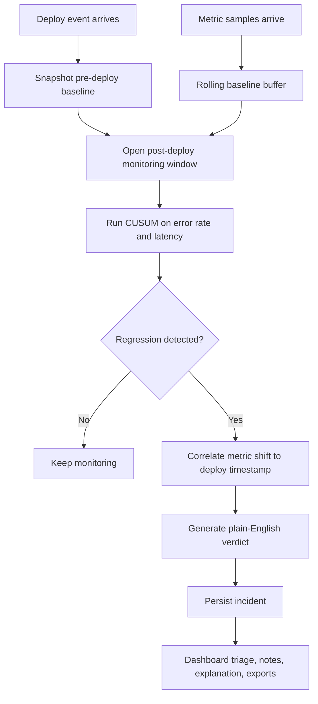
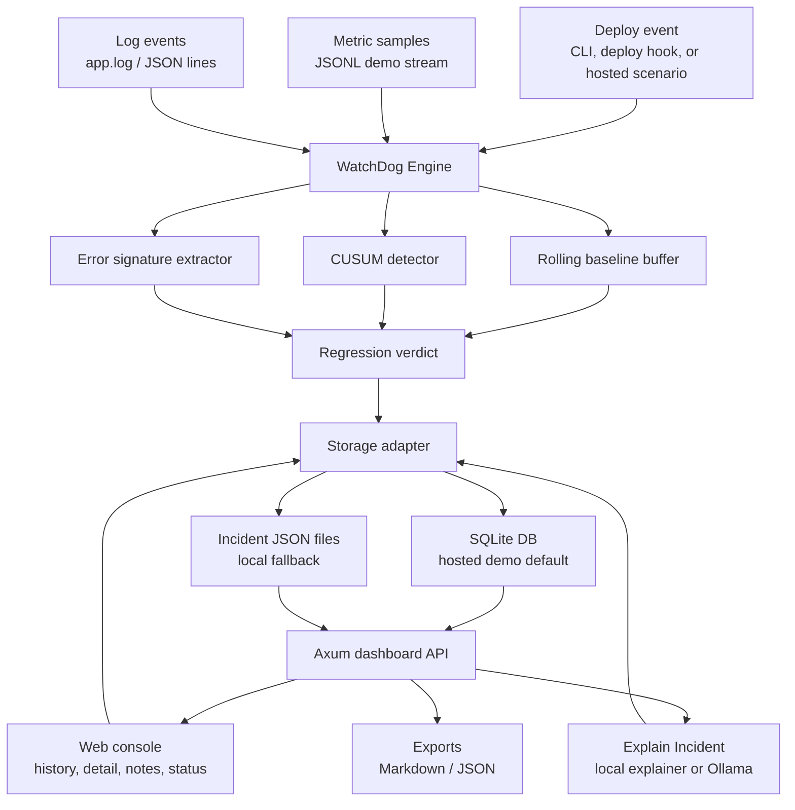

# WatchDog

Release regression detection for engineering teams.

`WatchDog` answers one question after every deploy: `did this release break something?`
It correlates a deploy event with post-deploy changes in error rate, latency, and log signatures, then saves a triage-ready incident with evidence, notes, exports, and an explanation.

The intended user is an engineer, SRE, or engineering manager who needs to understand whether a release caused customer-facing risk without reading raw metrics and logs first.

## Why this is a strong Rust project

- Solves a real production problem that every backend team understands
- Uses Rust for a low-overhead, always-on streaming process
- Demonstrates event correlation, rolling baselines, anomaly detection, and alerting
- Produces measurable benchmark output instead of vague claims

## What it does

- Watches a metrics stream from a JSONL source in the MVP
- Accepts deploy notifications from a CLI command or deploy script hook
- Builds a rolling baseline from recent pre-deploy samples
- Runs CUSUM change detection on error rate and latency
- Attributes suspicious shifts and repeated new error signatures to a specific deploy
- Persists incident records with status, notes, explanation cache, and export endpoints
- Serves a product dashboard for incident review and demo scenarios
- Emits a human-readable verdict to stdout, webhook, and the dashboard

## Flow



## Architecture

- [`src/app.rs`](./src/app.rs): CLI entrypoints and runtime orchestration
- [`src/engine.rs`](./src/engine.rs): deploy correlation state machine
- [`src/detector.rs`](./src/detector.rs): CUSUM-based change detection
- [`src/buffer.rs`](./src/buffer.rs): rolling metric baseline buffer
- [`src/alert.rs`](./src/alert.rs): alert rendering and webhook delivery
- [`src/benchmark.rs`](./src/benchmark.rs): deterministic benchmark scenarios
- [`src/dashboard.rs`](./src/dashboard.rs): hosted dashboard, health endpoint, incident APIs, and demo scenario trigger
- [`src/storage.rs`](./src/storage.rs): durable incident persistence with SQLite for hosted demos and JSON files as a local fallback

## Quick start

Create a ready-to-demo bad deploy incident:

```bash
cargo run -- demo
cargo run -- serve --state-dir .watchdog-demo --port 3001
```

Open `http://127.0.0.1:3001`, then use the dashboard to:

- Run a checkout or payments deploy regression scenario from the sidebar
- Select the saved incident from history
- Generate or refresh the explanation
- Add investigation notes and mark the incident resolved
- Export Markdown or JSON for handoff

For hosted demos, see [`deploy/README.md`](./deploy/README.md):

- Vercel static GTM preview from `vercel-demo/`
- Dockerized Rust dashboard for Render, Railway, Fly.io, or any Docker host
- Deployment notes for persistent state and lightweight explanations

The live dashboard exposes `GET /healthz` for deployment checks.
Environment examples are in [`.env.example`](./.env.example).

Use SQLite-backed demo storage locally:

```bash
WATCHDOG_STORAGE=sqlite \
WATCHDOG_DATABASE_URL=.watchdog-demo/watchdog.sqlite \
WATCHDOG_EXPLAINER=local \
cargo run -- serve --state-dir .watchdog-demo --port 3001
```

Run the streaming synthetic bad deploy demo:

```bash
cargo run -- simulate --state-dir .WatchDog --deploy v1.4.2 --bad-deploy
cargo run -- run --state-dir .WatchDog
```

Run with a JSON config file:

```bash
cargo run -- run --state-dir .WatchDog --config watchdog.config.json
```

Example config:

```json
{
  "baseline_capacity": 120,
  "monitoring_window_secs": 300,
  "log_file": ".WatchDog/app.log",
  "webhook_url": "https://hooks.example.test/watchdog",
  "detector": {
    "error_threshold": 0.08,
    "error_drift": 0.002,
    "latency_threshold": 120.0,
    "latency_drift": 5.0
  }
}
```

CLI flags such as `--log-file`, `--monitoring-window-secs`, and `--webhook-url` override config file values.

Slack incoming webhook URLs get a richer alert payload with Block Kit sections for the regression summary, metric deltas, dominant error signature, and timeline. Other webhook URLs receive the plain text alert body.

## Incident explanations

The dashboard can explain an incident with Ollama or a built-in lightweight explainer.
By default, `WATCHDOG_EXPLAINER=auto` tries Ollama first and falls back to the local explainer if Ollama is not running, which keeps the demo flow reliable.

```bash
# Always use the built-in lightweight explainer
WATCHDOG_EXPLAINER=local cargo run -- serve --state-dir .watchdog-demo --port 3001

# Require Ollama instead of falling back locally
WATCHDOG_EXPLAINER=ollama WATCHDOG_OLLAMA_MODEL=gemma3 cargo run -- serve --state-dir .watchdog-demo --port 3001
```

The local explainer uses the captured incident evidence only: deploy timing, metric deltas, dominant error signature, request rate, and baseline comparison.

## Real vs simulated

- Real: Rust detection engine, CUSUM metric shift detection, deploy correlation, log signature extraction, SQLite or JSON incident persistence, notes/status updates, exports, health endpoint, and dashboard APIs.
- Simulated for demo: JSONL metrics, deploy events, and log lines generated by `cargo run -- demo`, `cargo run -- simulate`, or the hosted dashboard scenario buttons.
- Replaceable in production: JSONL ingestion can be swapped for Prometheus/OpenTelemetry/webhook ingestion while keeping the detection, storage, and triage workflow.

## Architecture



Record a real deploy event:

```bash
cargo run -- notify --state-dir .WatchDog --deploy v1.4.2 --environment production
```

Run benchmark scenarios:

```bash
cargo run -- benchmark --trials 100
```

## Example benchmark output

```text
WatchDog benchmark summary
trials: 100
healthy false positives: 0
bad deploys detected: 100
bad deploys missed: 0
average detection latency: 4.00s
best detection latency: 4s
worst detection latency: 4s
```

This benchmark is deterministic and scoped to the built-in synthetic scenarios. It is a repo quality signal, not a universal production guarantee.

## Demo data format

`WatchDog` reads and writes JSONL files inside the state directory:

- `metrics.jsonl`
- `deploy-events.jsonl`
- `watchdog.sqlite` when `WATCHDOG_STORAGE=sqlite`

Example metric sample:

```json
{"timestamp":"2026-03-30T19:30:00Z","error_rate":0.02,"p95_latency_ms":190.0,"request_rate":1200.0}
```

## Integration example

A tiny deploy hook is included at [`examples/deploy.sh`](./examples/deploy.sh). It shows how a deploy pipeline can notify `WatchDog` with one line.

## What to build next

- Prometheus or OpenTelemetry metrics ingestion
- Database-backed multi-tenant storage
- GitHub Actions or deploy-platform integration for automatic deploy notifications
