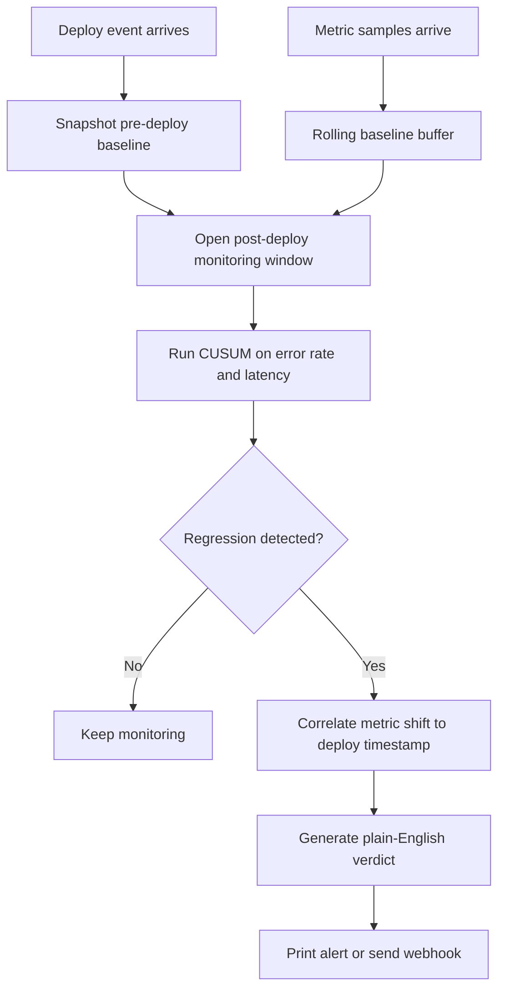

# WatchDog

Detects deployment-linked regressions in seconds.

`WatchDog` is a Rust daemon that answers one question after every deploy: `did this release break something?`
It correlates a known deploy event with post-deploy changes in error rate and latency, then emits a plain-English verdict with timing and impact details.

## Why this is a strong Rust project

- Solves a real production problem that every backend team understands
- Uses Rust for a low-overhead, always-on streaming process
- Demonstrates event correlation, rolling baselines, anomaly detection, and alerting
- Produces measurable benchmark output instead of vague claims

## What it does

- Watches a metrics stream from a JSONL source in the MVP
- Accepts deploy notifications from a CLI command or deploy script hook
- Builds a rolling baseline from recent pre-deploy samples
- Runs CUSUM change detection on error rate and latency
- Attributes suspicious shifts to a specific deploy when timing lines up
- Emits a human-readable verdict to stdout or a webhook

## Flow



## Architecture

- [`src/app.rs`](./src/app.rs): CLI entrypoints and runtime orchestration
- [`src/engine.rs`](./src/engine.rs): deploy correlation state machine
- [`src/detector.rs`](./src/detector.rs): CUSUM-based change detection
- [`src/buffer.rs`](./src/buffer.rs): rolling metric baseline buffer
- [`src/alert.rs`](./src/alert.rs): alert rendering and webhook delivery
- [`src/benchmark.rs`](./src/benchmark.rs): deterministic benchmark scenarios

## Quick start

Run a synthetic bad deploy demo:

```bash
cargo run -- simulate --state-dir .WatchDog --deploy v1.4.2 --bad-deploy
cargo run -- run --state-dir .WatchDog
```

Record a real deploy event:

```bash
cargo run -- notify --state-dir .WatchDog --deploy v1.4.2 --environment production
```

Run benchmark scenarios:

```bash
cargo run -- benchmark --trials 100
```

## Example benchmark output

```text
WatchDog benchmark summary
trials: 100
healthy false positives: 0
bad deploys detected: 100
bad deploys missed: 0
average detection latency: 4.00s
best detection latency: 4s
worst detection latency: 4s
```

This benchmark is deterministic and scoped to the built-in synthetic scenarios. It is a repo quality signal, not a universal production guarantee.

## Demo data format

`WatchDog` reads and writes JSONL files inside the state directory:

- `metrics.jsonl`
- `deploy-events.jsonl`

Example metric sample:

```json
{"timestamp":"2026-03-30T19:30:00Z","error_rate":0.02,"p95_latency_ms":190.0,"request_rate":1200.0}
```

## Integration example

A tiny deploy hook is included at [`examples/deploy.sh`](./examples/deploy.sh). It shows how a deploy pipeline can notify `WatchDog` with one line.

## What to build next

- Prometheus or OpenTelemetry metrics ingestion
- Slack-specific alert formatting with timelines
- Config file support for thresholds and monitoring windows
- Log anomaly detection as a second signal after metrics
- GitHub Actions or container deploy integration for end-to-end demos
